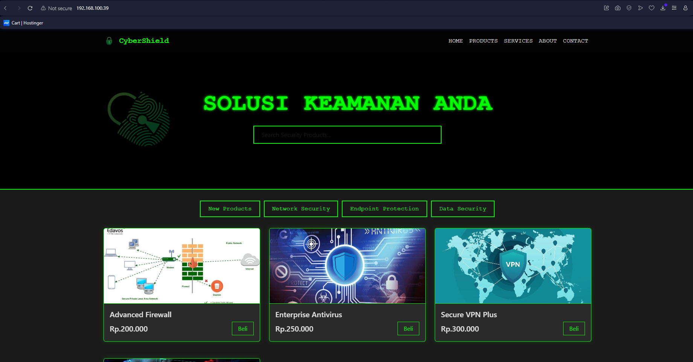

# FINAL-PROJECT-SISTEM PERTAHANAN JARINGAN---KELOMPOK 5

pada repository tersebut berisi dokumentasi pengerjaan. berikut pemeparan langkah-langkah analisis risiko untuk mengidentifikasi potensi celah keamanan, serta menerapkan 4 teknik hardening server

## Daftar Isi
- [Membangun Server Nginx](#1-membangun-server-dengan-nginx)
- [Pemindai Kerentanan](#2-pemindai-kerentanan)
- [Hardening Server Ubuntu](#3-hardening-server)


# 1. MEMBANGUN SERVER DENGAN NGINX
Nginx adalah perangkat lunak web server open-source yang berfungsi sebagai reverse proxy, load balancer, dan HTTP cache. Nginx memiliki beberapa kelebihan, di antaranya: 
- Dapat menangani banyak koneksi secara bersamaan 
- Efisien dalam penggunaan sumber daya 
- Dukungan OS yang luas, termasuk Linux, Unix, dan Windows 
- Pemeliharaan konfigurasi real-time

    ## Step 1: Instalasi Nginx

    1. Update dan Upgrade Sistem:
        ```bash
        sudo apt update
        ```

    2. Instal Nginx:
        ```bash
        sudo apt install nginx
        ```

    3. Izinkan Akses Firewall:
        ```bash
        sudo ufw allow 'Nginx HTTP'
        ```

    ## Step 2: Clone Repository Web dari GitHub

    1. Instal Git (Jika Belum Terinstal):
        ```bash
        sudo apt install git
        ```
    
    2. Clone Repository: Gantilah URL_REPOSITORY dengan URL GitHub repository Anda:
        ```bash
        sudo git clone https://github.com/okeyy07-rgb/cybershild.github.io.git /var/www/html/kelompok5
        ```
    
    ## Step 3: Konfogirasi Nginx
    1. Buat File Konfigurasi Baru untuk Situs Anda:
        ```bash
        sudo nano /etc/nginx/sites-available/kelompok5
        ```
    
    2. Isi File dengan Konfigurasi Berikut: Gantilah IP_SERVER dengan IP server Ubuntu Anda. Pastikan direktori root sesuai dengan lokasi clone repository Anda.
        ```bash
        server {
            listen 80;
            server_name 192.168.100.44;
            root /var/www/kelompok5/cybershildd.gihub.io;
            index index.html;

            location / {
                auth_basic "Restricted Content";
                auth_basic_user_file /etc/nginx/.htpasswd;
                try_files $uri $uri/ =404;

                ## Rate Limiting ##
                limit_req zone=one burst=5 nodelay;

                ## Security Headers ##
                add_header X-Frame-Options "SAMEORIGIN";
                add_header X-XSS-Protection "1; mode=block";
                add_header X-Content-Type-Options "nosniff";
                add_header Strict-Transport-Security "max-age=31536000; includeSubdomains; preload";

                ## Cache Control ##
                expires 1d;
                add_header Cache-Control "public, must-revalidate, proxy-revalidate";
            }
        }

        server {
            listen 443 ssl http2;
            server_name 192.168.100.44;

            ssl_certificate /etc/ssl/certs/nginx-selfsigned.crt;
            ssl_certificate_key /etc/ssl/private/nginx-selfsigned.key;
            ssl_dhparam /etc/nginx/dhparam.pem;

            root /var/www/kelompok5/cybershildd.gihub.io;
            index index.html;

            location / {
                auth_basic "Restricted Content";
                auth_basic_user_file /etc/nginx/.htpasswd;
                try_files $uri $uri/ =404;

                ## Security Headers ##
                add_header X-Frame-Options "SAMEORIGIN";
                add_header X-XSS-Protection "1; mode=block";
                add_header X-Content-Type-Options "nosniff";
                add_header Strict-Transport-Security "max-age=31536000; includeSubdomains; preload";
                
                ## Cache Control ##
                expires 1d;
                add_header Cache-Control "public, must-revalidate, proxy-revalidate";
            }
        }

        server {
            listen 80;
            server_name 192.168.100.44;

            location / {
                proxy_cache my_cache;
                proxy_cache_valid 200 302 10m;
                proxy_cache_valid 404 1m;
                proxy_cache_use_stale error timeout invalid_header updating http_500 http_502 http_503 http_504;
                proxy_cache_lock on;
                proxy_cache_revalidate on;
                proxy_pass http://backend;
                proxy_set_header Host $host;
                proxy_set_header X-Real-IP $remote_addr;
                proxy_set_header X-Forwarded-For $proxy_add_x_forwarded_for;
                try_files $uri $uri/ =404;

                ## Security Headers ##
                add_header X-Frame-Options "SAMEORIGIN";
                add_header X-XSS-Protection "1; mode=block";
                add_header X-Content-Type-Options "nosniff";
                add_header Strict-Transport-Security "max-age=31536000; includeSubdomains; preload";

                ## Cache Control ##
                expires 1d;
                add_header Cache-Control "public, must-revalidate, proxy-revalidate";
            }
        }
        ```

    3. Konfigurasi Global Nginx:
        ```bash
        user www-data;
        worker_processes auto;
        pid /run/nginx.pid;
        include /etc/nginx/modules-enabled/*.conf;

        events {
            worker_connections 768;
            # multi_accept on;
        }

        http {
            # Definisikan upstream
            upstream backend {
                server 192.168.100.44:8080;
            }

            # Rate Limiting Configuration
            limit_req_zone $binary_remote_addr zone=one:10m rate=1r/s;

            ##
            # Basic Settings
            ##
            sendfile on;
            tcp_nopush on;
            tcp_nodelay on;
            types_hash_max_size 2048;
            include /etc/nginx/mime.types;
            default_type application/octet-stream;

            ##
            # SSL Settings
            ##
            ssl_protocols TLSv1 TLSv1.1 TLSv1.2 TLSv1.3; # Dropping SSLv3, ref: POODLE
            ssl_prefer_server_ciphers on;

            ##
            # Logging Settings
            ##
            access_log /var/log/nginx/access.log;
            error_log /var/log/nginx/error.log;

            ##
            # Gzip Settings
            ##
            gzip on;
            gzip_vary on;
            gzip_proxied any;
            gzip_comp_level 6;
            gzip_buffers 16 8k;
            gzip_http_version 1.1;
            gzip_types text/plain text/css application/json application/javascript text/xml application/xml application/xml+rss text/javascript;

            ##
            # Additional Security Headers
            ##
            add_header X-Frame-Options "SAMEORIGIN";
            add_header X-XSS-Protection "1; mode=block";
            add_header X-Content-Type-Options "nosniff";
            add_header Strict-Transport-Security "max-age=31536000; includeSubdomains; preload";

            ##
            # Client Max Body Size
            ##
            client_max_body_size 16M;

            ##
            # Proxy Cache Path
            ##
            proxy_cache_path /var/cache/nginx levels=1:2 keys_zone=my_cache:10m max_size=1g inactive=60m use_temp_path=off;

            ##
            # Include Virtual Host Configs
            ##
            include /etc/nginx/conf.d/*.conf;
            include /etc/nginx/sites-enabled/*;
        }
        ```

    4. Aktifkan Konfigurasi Situs: Buat simbolik link dari sites-available ke sites-enabled: 
        ```bash
        sudo ln -s /etc/nginx/sites-available/kelompok5 /etc/nginx/sites-enabled/
        ```
    5. Hak Akses Direktori dan File:

        Pastikan Nginx memiliki hak akses ke direktori root (/var/www/kelompok5/cybershildd.github.io). Anda bisa mengatur kepemilikan dan hak akses dengan perintah berikut:
        ```sh
        sudo chown -R www-data:www-data /var/www/kelompok5
        sudo chmod -R 755 /var/www/kelompok5
        ```
    
    6. Buat Sertifikat SSL Self-Signed:

        Anda bisa membuat sertifikat SSL self-signed untuk pengujian. Jalankan perintah berikut untuk membuat sertifikat SSL:
        ```sh
        sudo openssl req -x509 -nodes -days 365 -newkey rsa:2048 -keyout /etc/ssl/private/nginx-selfsigned.key -out /etc/ssl/certs/nginx-selfsigned.crt
        ```

        Anda juga perlu membuat Diffie-Hellman parameter file:
        ```sh
        sudo openssl dhparam -out /etc/nginx/dhparam.pem 2048
        ```
    
    7. Buat File .htpasswd:

        Kita bisa menggunakan perintah htpasswd untuk membuat file .htpasswd. Jika Anda belum menginstal htpasswd, Anda bisa menginstalnya dengan:
        ```sh
        sudo apt-get install apache2-utils
        ```
        Setelah itu, buat file .htpasswd dan tambahkan pengguna:
        ```sh
        sudo htpasswd -c /etc/nginx/.htpasswd username
        ```
        Gantilah username dengan nama pengguna yang Anda inginkan. Anda akan diminta untuk memasukkan dan mengonfirmasi kata sandi untuk pengguna ini.

    8. Tes Konfigurasi Nginx: Pastikan tidak ada kesalahan dalam konfigurasi Nginx:
        ```bash
        sudo nginx -t
        ```
    
    9. Restart Nginx: Restart Nginx untuk menerapkan perubahan konfigurasi:
        ```bash
        sudo systemctl restart nginx
        ```
    
    ## Step 4: Akses Situs Web Anda
    Buka browser dan akses situs web Anda menggunakan alamat IP server Ubuntu Anda, misalnya: http://IP_SERVER.
    


# 2. PEMINDAI KERENTANAN
1. Step 1: Perbarui Paket Sistem: Pastikan sistem Anda menggunakan paket terbaru:
    ```bash 
    sudo apt update
    ```

2. Step 2: Instal Nmap: Instal Nmap dengan perintah berikut:
    ```bash
    sudo apt install nmap
    ```

## Pemindaian Dasar dengan Nmap

Nmap menawarkan berbagai opsi pemindaian. Berikut adalah beberapa pemindaian dasar yang dapat Anda coba:
1. Pemindaian Host untuk Mendapatkan Informasi Dasar: Untuk memindai host dan mendapatkan informasi dasar tentang port yang terbuka, gunakan:
    ```bash
    nmap 192.168.100.39
    ```

2. Pemindaian untuk Mengetahui Versi Layanan: Untuk mendapatkan informasi tentang versi layanan yang berjalan di port terbuka, gunakan:
    ```bash
    nmap -sV 192.168.100.39
    ```

3. Pemindaian untuk Mengetahui Kerentanan: Untuk menjalankan pemindaian dengan skrip NSE (Nmap Scripting Engine) dan mendeteksi kerentanan, gunakan:
    ```bash
    nmap --script=vuln 192.168.100.39
    ```

## Menggunakan Skrip NSE untuk Kerentanan Tertentu
Nmap memiliki berbagai skrip yang dapat Anda gunakan untuk memeriksa kerentanan tertentu. Berikut adalah contoh penggunaannya:
1. Pemindaian Kerentanan SSL/TLS: Untuk memeriksa kerentanan SSL/TLS, gunakan skrip berikut:
    ```bash
    sudo nmap --script ssl-enum-ciphers -p 443 192.168.100.39
    ```

2. Pemindaian Kerentanan HTTP: Untuk memeriksa kerentanan pada server HTTP, gunakan:
    ```bash
    sudo nmap --script http-vuln* -p 80,443 192.168.100.39
    ```

## Menyimpan Hasil Pemindaian
Anda dapat menyimpan hasil pemindaian ke dalam file untuk analisis lebih lanjut:
1. Menyimpan Hasil dalam Format Teks:
    ```bash
    nmap -oN hasil_scan.txt 192.168.100.39
    ```

2. Menyimpan Hasil dalam Format XML:
    ```bash
    nmap -oX hasil_scan.xml 192.168.100.39
    ```

3. Menyimpan Hasil dalam Format Grepable:
    ```bash
    nmap -oG hasil_scan.gnmap 192.168.100.39
    ```


# 3. HARDENING SERVER
## Update dan Upgrade Sistem

Pastikan sistem Anda selalu menggunakan paket terbaru untuk meminimalkan celah keamanan:
```bash
sudo apt update
sudo apt upgrade
```

## Installasi dan Konfigurasi Firewall

Gunakan UFW (Uncomplicated Firewall) untuk mengkonfigurasi firewall:
```bash
sudo apt install ufw
sudo ufw enable
sudo ufw allow ssh
sudo ufw allow http
sudo ufw allow https
sudo ufw allow 22/tcp
sudo ufw allow 80/tcp
sudo ufw allow 443/tcp
sudo ufw allow 55/tcp
```

## 1. KONFIGURASI SSH
Konfigurasi SSH untuk meningkatkan keamanan:
```bash    
sudo nano /etc/ssh/sshd_config
```

- Ganti Port 22 menjadi port lain untuk menghindari serangan yang umum:
    ```bash
    Port 55
    ```

- Setel PermitRootLogin no untuk mencegah login root langsung:
    ```bash
    PermitRootLogin no
    ```

- Setel PasswordAuthentication no dan gunakan autentikasi berbasis SSH key:
    ```bash
    PasswordAuthentication no

- Setel MaxAuthTries 3 untuk membatasi percobaan login:
    ```bash
    MaxAuthTries 3
    ```

- Setel AllowAgentForwarding no dan AllowTcpForwarding no untuk membatasi penerusan:
    ```bash
    AllowAgentForwarding no
    AllowTcpForwarding no
    ```


    
## 2. MENGAKTIFKAN DAN MENGKONFIGURASI FAIL2BAN

Fail2Ban membantu mencegah serangan brute-force dengan memblokir IP yang mencoba login yang gagal:
```bash
sudo apt install fail2ban
sudo systemctl enable fail2ban
sudo systemctl start fail2ban
```
Konfigurasi jail.local untuk menyesuaikan pengaturan Fail2Ban sesuai kebutuhan:
```bash
sudo nano /etc/fail2ban/jail.local
```
Konfigurasi: Tambahkan atau sesuaikan konfigurasi dasar sesuai kebutuhan Anda. Berikut adalah contoh 
konfigurasi dasar untuk SSH:
```plaintext
[DEFAULT]
# Bantime, Findtime, dan Maxretry adalah pengaturan umum
bantime  = 3600
findtime = 600
maxretry = 5

# Jail untuk SSH
[sshd]
enabled = true
port    = ssh
filter  = sshd
logpath = /var/log/auth.log

# Jail untuk Apache (HTTP Authentication)
[apache-auth]
enabled = true
port    = http,https
filter  = apache-auth
logpath = /var/log/apache2/error.log
maxretry = 3

# Jail untuk Apache (Bad Bots)
[apache-badbots]
enabled = true
port    = http,https
filter  = apache-badbots
logpath = /var/log/apache2/access.log
maxretry = 1
bantime = 86400

# Jail untuk Postfix (SMTP)
[postfix]
enabled = true
port    = smtp,ssmtp
filter  = postfix
logpath = /var/log/mail.log
maxretry = 3

# Jail untuk Dovecot (IMAP/POP3)
[dovecot]
enabled = true
port    = pop3,pop3s,imap,imaps
filter  = dovecot
logpath = /var/log/mail.log
maxretry = 5

# Jail untuk Nginx (HTTP Authentication)
[nginx-http-auth]
enabled = true
port    = http,https
filter  = nginx-http-auth
logpath = /var/log/nginx/error.log
maxretry = 3
```
1. Konfigurasi Umum [DEFAULT]

    Bagian [DEFAULT] berisi pengaturan umum yang akan diterapkan ke semua jail yang diaktifkan kecuali diubah oleh pengaturan spesifik jail:

    - bantime = 3600: Durasi (dalam detik) untuk memblokir IP yang mencoba serangan setelah mencapai batas maksimum percobaan. Disini ditetapkan selama 1 jam (3600 detik).

    - findtime = 600: Waktu (dalam detik) di mana percobaan harus terjadi agar IP diblokir. Jika ada percobaan gagal 5 kali dalam 10 menit (600 detik), maka IP akan diblokir.

    - maxretry = 5: Jumlah maksimal percobaan yang diizinkan dalam periode findtime sebelum IP diblokir.


2. Jail untuk SSH

    [sshd]: Jail ini memonitor layanan SSH.

    - enabled = true: Mengaktifkan jail ini.

    - port = ssh: Menentukan port yang digunakan oleh SSH (biasanya port 22).

    - filter = sshd: Menggunakan filter sshd untuk memproses log.

    - logpath = /var/log/auth.log: Menentukan jalur file log yang akan dipantau untuk entri log SSH.

3. Jail untuk Apache (HTTP Authentication)

    [apache-auth]: Jail ini memonitor upaya autentikasi di Apache.

    - enabled = true: Mengaktifkan jail ini.

    - port = http,https: Menentukan port yang digunakan oleh Apache (80 untuk HTTP dan 443 untuk HTTPS).

    - filter = apache-auth: Menggunakan filter apache-auth untuk memproses log.

    - logpath = /var/log/apache2/error.log: Menentukan jalur file log yang akan dipantau.

    - maxretry = 3: Membatasi jumlah maksimal percobaan autentikasi sebelum IP diblokir.

4. Jail untuk Nginx (HTTP Authentication)

    [nginx-http-auth]: Jail ini memonitor upaya autentikasi HTTP di Nginx.

    - enabled = true: Mengaktifkan jail ini.

    - port = http,https: Menentukan port yang digunakan oleh Nginx.

    - filter = nginx-http-auth: Menggunakan filter nginx-http-auth untuk memproses log.

    - logpath = /var/log/nginx/error.log: Menentukan jalur file log yang akan dipantau.

    - maxretry = 3: Membatasi jumlah maksimal percobaan autentikasi sebelum IP diblokir.

Karena saya menggunakan nginx sebagai layanan web server, jadi yang saya jelaskan konfigurasi layanan nginx saja.

Setelah mengedit jail.local, pastikan untuk merestart Fail2Ban agar perubahan diterapkan:
```bash
sudo systemctl restart fail2ban
```


## 3. Pengaturan Pengguna dan Hak Akses
1. Buat Pengguna Baru: Untuk menambahkan pengguna baru, gunakan perintah:
    ```bash
    sudo adduser okeyy
    ```
    Anda akan diminta untuk memasukkan informasi seperti kata sandi dan detail pengguna. Isi informasi ini sesuai dengan kebutuhan Anda. "okeyy" di ganti dengan nama yang anda inginkan
    
2. Verifikasi Pengguna Baru: Setelah menambahkan pengguna, Anda dapat memeriksa apakah pengguna sudah ada dengan:
        ```bash
        id nama_pengguna
        ```

3. Menambahkan Pengguna ke Grup Sudo: Agar pengguna bisa menggunakan perintah sudo, tambahkan pengguna tersebut ke grup sudo:
    ```bash
    sudo usermod -aG sudo nama_pengguna
    ```

4. Verifikasi Hak Akses Sudo: Login sebagai pengguna baru dan coba perintah dengan sudo:
    ```bash
    su - okeyy
    sudo whoami
    ```
    Jika berhasil, output akan menunjukkan root.
    

5. Mengatur Kepemilikan (Ownership): Gunakan perintah chown untuk mengatur kepemilikan file 
    dan direktori:
    ```bash
    sudo chown okeyy:okeyy /home/kelompok5
    ```
    Perintah di atas akan mengubah kepemilikan direktori /home/kelompok5
    
6. Mengatur Izin Tambahan Jika Diperlukan: Jika Anda perlu mengatur izin tambahan untuk file 
    atau direktori tertentu, gunakan perintah chmod:
    ```bash
    sudo chmod 755 /home/kelompok5
    ```
    Memberikan izin penuh kepada pemilik, dan izin baca serta eksekusi kepada grup dan lainnya

7. Menggunakan ACL untuk Izin Granular: Jika Anda perlu memberikan izin yang lebih spesifik kepada
    pengguna atau grup lain, gunakan ACL (Access Control Lists):
    - Edit /etc/fstab:
        ```bash
        sudo nano /etc/fstab
        ```

    - Modifikasi Baris yang Sesuai:
            
        Baris yang sesuai dengan mount point /:
        ```bash
        /dev/disk/by-id/dm-uuid-LVM-7R7Qzno3e1X13VEfJSWjp630Uno0nYvCKFSsCRDJGjhW6lb225R5p2DdhHew2yxR / ext4 defaults,acl 0 1
        ```
        Baris yang sesuai dengan mount point /boot (meskipun tidak selalu diperlukan di /boot):
        ```bash
        /dev/disk/by-uuid/d596c0dd-7a27-4442-ac4b-82feb274d0cd /boot ext4 defaults,acl 0 1
        ```
        
    - Remount Sistem Berkas: Untuk menerapkan perubahan tanpa harus merestart sistem, 
        remount sistem berkas dengan perintah:
        ```bash
        sudo mount -o remount,acl /
        sudo mount -o remount,acl /boot
        ```

    - Verifikasi Mount Options: Pastikan bahwa ACL telah diaktifkan dengan memeriksa mount options:
        ```bash
        mount | grep acl
        ```

        ```bash
        sudo apt install ACL
        sudo setfacl -m u:okeyy:rw /home/kelompok5 # Memberikan izin baca dan tulis kepada pengguna 'okeyy'
        sudo setfacl -m g:developers:r-x /home/kelompok5 # Memberikan izin baca kepada grup 'developers'
        ```

## 4. MENGATUR LOGGING SISTEM DENGAN RSYSLOG

Rsyslog adalah salah satu sistem logging yang paling umum digunakan di Linux. Berikut 
cara mengatur dan mengonfigurasinya:
    
- Instal Rsyslog (jika belum terinstal):
    ```bash
    sudo apt update
    sudo apt install rsyslog
    ```

- Konfigurasi Rsyslog: Edit file konfigurasi utama Rsyslog:
    ```bash
    sudo nano /etc/rsyslog.conf
    ```
    Pastikan baris berikut tidak dikomentari (hilangkan tanda # jika ada):
    ```plaintext
    module(load="imuxsock")  # provides support for local system logging
    module(load="imklog")    # provides kernel logging support
    ```
    

- Tambahkan File Konfigurasi Tambahan: Untuk mengatur log tambahan, Anda bisa menambahkan 
    file konfigurasi di direktori /etc/rsyslog.d/. Misalnya, buat file custom.conf:
    ```bash
    sudo nano /etc/rsyslog.d/custom.conf
    ```
    Tambahkan aturan logging sesuai kebutuhan. Contoh:
    ```plaintext
    # Auth logs
    auth,authpriv.*    /var/log/auth.log

    # System logs excluding auth
    *.*;auth,authpriv.none    /var/log/syslog

    # Kernel logs
    kern.*    /var/log/kern.log

    # Mail logs
    mail.*    /var/log/mail.log

    # Cron logs
    cron.*    /var/log/cron.log

    # Nginx logs
    if $programname == 'nginx' then /var/log/nginx.log
    & stop

    # UFW logs
    if $programname == 'UFW' then /var/log/ufw.log
    & stop

    # Sudo logs
    if $programname == 'sudo' then /var/log/sudo.log
    & stop
    ```
    

    Penjelasan Masing-masing Aturan
    - Autentikasi:

        Pesan dari fasilitas auth dan authpriv: Ini termasuk login, logout, percobaan login, dan perubahan password.

    - Pesan Sistem:

        Semua pesan: Ini akan mencatat semua pesan sistem umum kecuali yang terkait dengan autentikasi.

    - Kernel:

        Pesan kernel: Ini mencakup log yang dihasilkan oleh kernel.

    - Mail:

        Pesan mail: Log aktivitas terkait email, seperti pengiriman dan penerimaan.

    - Cron:

        Pesan cron: Ini mencatat aktivitas cron job yang terjadwal di sistem.

    - Nginx:

        Pesan Nginx: Log spesifik untuk server web Nginx.

    - UFW:

        Pesan UFW: Log aktivitas firewall yang dikelola oleh UFW.

    - Sudo:

        Pesan sudo: Ini mencatat semua penggunaan perintah sudo oleh pengguna di sistem.

- Restart Rsyslog: Setelah konfigurasi, restart layanan Rsyslog:
    ```bash
    sudo systemctl restart rsyslog
    ```

## 5. PENGATURAN AUDITD UNTUK PEMANTAUAN AKTIVITAS

Auditd adalah daemon untuk sistem audit yang memantau dan merekam berbagai aktivitas di sistem. Berikut cara mengatur dan mengonfigurasinya:
        
1. Instal Auditd:
    ```bash
    sudo apt update
    sudo apt install auditd
    ```

2. Konfigurasi Auditd: Edit file konfigurasi utama Auditd:
     ```bash
    sudo nano /etc/audit/auditd.conf
    ```
    Konfigurasi:
    ```plaintext
    # This file controls the configuration of the audit daemon

    local_events = yes
    write_logs = yes
    log_file = /var/log/audit/audit.log
    log_group = adm
    log_format = ENRICHED
    flush = INCREMENTAL_ASYNC
    freq = 50
    max_log_file = 8
    num_logs = 5
    priority_boost = 4
    name_format = NONE
    ##name = mydomain

    max_log_file_action = ROTATE
    space_left = 75
    space_left_action = SYSLOG
    verify_email = yes
    action_mail_acct = root
    admin_space_left = 50
    admin_space_left_action = SUSPEND
    disk_full_action = SUSPEND
    disk_error_action = SUSPEND
    use_libwrap = yes
    ##tcp_listen_port = 60
    tcp_listen_queue = 5
    tcp_max_per_addr = 1
    ##tcp_client_ports = 1024-65535
    tcp_client_max_idle = 0
    transport = TCP
    krb5_principal = auditd
    ##krb5_key_file = /etc/audit/audit.key
    distribute_network = no
    q_depth = 2000
    overflow_action = SYSLOG
    max_restarts = 10
    plugin_dir = /etc/audit/plugins.d
    end_of_event_timeout = 2
    ```
    

3. Mengatur Aturan Audit (Audit Rules): Aturan audit menentukan apa yang harus diaudit. 
    Edit file /etc/audit/rules.d/audit.rules untuk menambahkan aturan:
    ```bash
    sudo nano /etc/audit/rules.d/audit.rules
    ```
    Aturan Audit:
    ```plaintext
    ## First rule - delete all
    -D

    ## Increase the buffers to survive stress events.
    ## Make this bigger for busy systems
    -b 8192

    ## This determine how long to wait in burst of events
    --backlog_wait_time 60000

    ## Set failure mode to syslog
    -f 1

    ## Audit rules
    -w /etc/passwd -p wa -k passwd_changes
    -w /etc/shadow -p wa -k shadow_changes
    -w /etc/group -p wa -k group_changes
    -w /etc/ -p wa -k etc_changes
    -w /var/log/sudo.log -p wa -k sudo_usage
    -w /var/log/auth.log -p wa -k auth_logs
    -w /var/run/utmp -p wa -k session
    -w /var/log/wtmp -p wa -k session
    -w /var/log/btmp -p wa -k session
    -w /etc/ssh/sshd_config -p wa -k ssh_config_changes
    -a always,exit -F path=/bin/chmod -F perm=x -F auid>=1000 -F auid!=4294967295 -k chmod
    -a always,exit -F path=/bin/chown -F perm=x -F auid>=1000 -F auid!=4294967295 -k chown
    -a always,exit -F path=/usr/bin/passwd -F perm=x -F auid>=1000 -F auid!=4294967295 -k passwd_changes
    -a always,exit -F arch=b64 -S execve -k exec_64
    -a always,exit -F arch=b32 -S execve -k exec_32
    -w /etc/sudoers -p wa -k sudoers_changes
    -a always,exit -F dir=/home -F perm=wa -F auid>=1000 -F auid!=4294967295 -k home_modifications
    ```
    

    Berikut aturan apa saja yang saya masukkan:
        

    - -D: Menghapus semua aturan audit yang ada sebelum menambahkan aturan baru.

    - -b 8192: Menentukan ukuran buffer untuk menangani kejadian audit selama periode stres atau aktivitas tinggi. Ukuran buffer ditingkatkan menjadi 8192.

    - --backlog_wait_time 60000: Menentukan waktu tunggu dalam milidetik untuk burst kejadian audit. Diatur ke 60000 ms (60 detik).

    - -f 1: Mengatur mode kegagalan audit untuk mengirim pesan ke syslog jika terjadi kegagalan.
            
    Aturan Audit untuk Pemantauan Sistem:
    - -w /etc/passwd -p wa -k passwd_changes: Memantau perubahan (write) dan akses (attribute change) pada file /etc/passwd.

    - -w /etc/shadow -p wa -k shadow_changes: Memantau perubahan (write) dan akses (attribute change) pada file /etc/shadow.

    - -w /etc/group -p wa -k group_changes: Memantau perubahan (write) dan akses (attribute change) pada file /etc/group.

    - -w /etc/ -p wa -k etc_changes: Memantau perubahan (write) dan akses (attribute change) pada seluruh direktori /etc.

    - -w /var/log/sudo.log -p wa -k sudo_usage: Memantau perubahan (write) dan akses (attribute change) pada file log sudo.

    - -w /var/log/auth.log -p wa -k auth_logs: Memantau perubahan (write) dan akses (attribute change) pada file log autentikasi.

    - -w /var/run/utmp -p wa -k session: Memantau perubahan (write) dan akses (attribute change) pada file utmp yang mencatat sesi login aktif.

    - -w /var/log/wtmp -p wa -k session: Memantau perubahan (write) dan akses (attribute change) pada file wtmp yang mencatat semua sesi login dan logout.

    - -w /var/log/btmp -p wa -k session: Memantau perubahan (write) dan akses (attribute change) pada file btmp yang mencatat percobaan login yang gagal.

    - -w /etc/ssh/sshd_config -p wa -k ssh_config_changes: Memantau perubahan (write) dan akses (attribute change) pada file konfigurasi SSH.

    Aturan Audit untuk Memantau Eksekusi Perintah:

    - -a always,exit -F path=/bin/chmod -F perm=x -F auid>=1000 -F auid!=4294967295 -k chmod: Memantau eksekusi perintah chmod oleh pengguna dengan auid di atas 1000 (biasanya pengguna non-sistem).

    - -a always,exit -F path=/bin/chown -F perm=x -F auid>=1000 -F auid!=4294967295 -k chown: Memantau eksekusi perintah chown oleh pengguna dengan auid di atas 1000.

    - -a always,exit -F path=/usr/bin/passwd -F perm=x -F auid>=1000 -F auid!=4294967295 -k passwd_changes: Memantau eksekusi perintah passwd oleh pengguna dengan auid di atas 1000.

    - -a always,exit -F arch=b64 -S execve -k exec_64: Memantau eksekusi semua perintah 64-bit.

    - -a always,exit -F arch=b32 -S execve -k exec_32: Memantau eksekusi semua perintah 32-bit.

    - -w /etc/sudoers -p wa -k sudoers_changes: Memantau perubahan (write) dan akses (attribute change) pada file konfigurasi sudoers.

    - -a always,exit -F dir=/home -F perm=wa -F auid>=1000 -F auid!=4294967295 -k home_modifications: Memantau perubahan (write) dan akses (attribute change) pada direktori home oleh pengguna dengan auid di atas 1000.


4. Restart Auditd: Setelah menambahkan aturan, restart layanan Auditd:
    ```bash
    sudo systemctl restart auditd
    ```

#
# SEKIAN TERIMA KASIH ----
            
        


